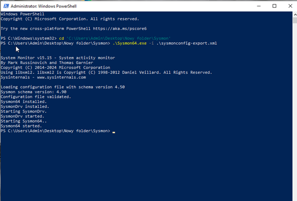
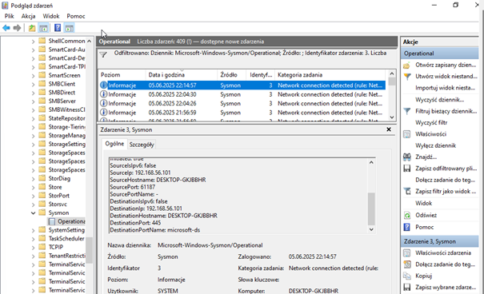
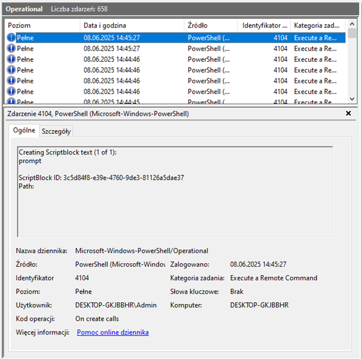
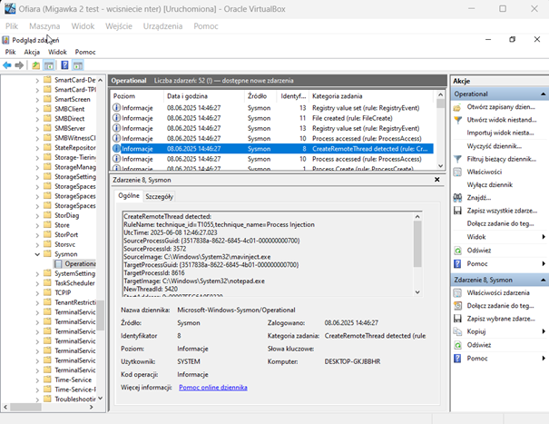
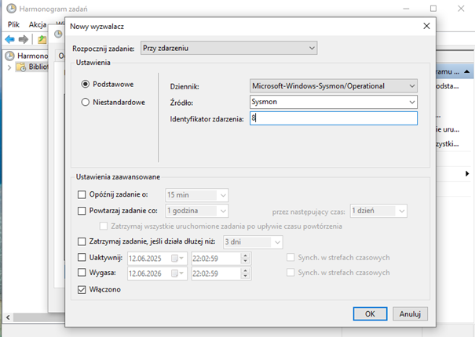
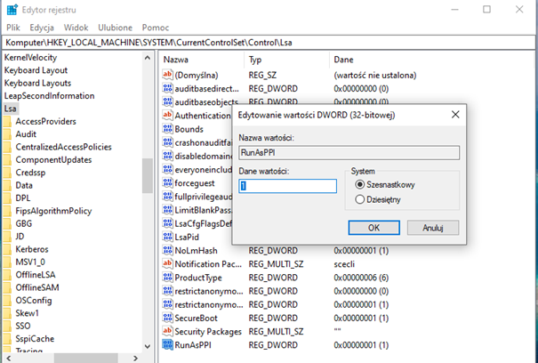

# MITRE ATT&CK: Modeling and Evaluation of Defense Strategies 

## Project Overview
Technical implementation of a Master's Thesis: **"Application of the MITRE ATT&CK Matrix in Modeling and Assessing the Effectiveness of Defense Strategies Against Cyber Attack Techniques"**. 

The project evaluates the detection and mitigation capabilities of a Windows-based system against specific techniques from the MITRE ATT&CK framework.

## Test Environment
* **Virtualization:** Oracle VirtualBox (Isolated Host-Only Network).
* **Endpoint:** Windows 10 (IP: `192.168.56.101`).
* **Attack Tool:** [Atomic Red Team](https://github.com/redcanaryco/atomic-red-team) (Invoke-AtomicRedTeam module).
* **Logging & Monitoring:**
    * **Sysmon:** Custom configuration capturing Event IDs: 1 (Process Creation), 3 (Network Connection), 7 (Image Loaded), 8 (CreateRemoteThread), 10 (ProcessAccess), 11 (FileCreate).
    * **PowerShell Logging:** Script Block Logging enabled (**Event ID 4104**).
    * **Windows Auditing:** Process Creation auditing enabled (**Event ID 4688**).
    * **Network Security:** Windows Defender Firewall (block-by-default mode).

  
   
  <i>Deployment and configuration of Sysmon using a customized XML schema.</i>

---

## Attack Scenarios and Mitigations

### Scenario A: Network Service Scanning (T1046)
* **Attack:** PowerShell script scanning TCP ports 1-1024. Identified open ports: 135, 139, 445.
* **Detection:** **Sysmon Event ID 3** (Network connection detected).
* **Mitigation (M1042):** Disabling the **"Server" (LanmanServer)** service and stopping it via `services.msc`.
* **Result:** Re-scan confirmed ports 139 and 445 were no longer accessible.

  
   
  <i>Detection of T1046 (Network Service Scanning) via Sysmon Event ID 3, showing source IP and target ports.</i>

### Scenario B: PowerShell Download and Execute (T1059.001)
* **Attack:** Remote payload download and execution using PowerShell.
* **Detection:** Over 40 entries in **PowerShell/Operational** (ID 4104). **Sysmon Event ID 1** and **Event ID 11** (File creation).
* **Mitigation (M1049):** Windows Defender Real-time Protection.
* **Result:** Initial attack was blocked by Defender. After disabling AV, the attack was fully logged by PowerShell Script Block Logging.

  
   
  <i>Leveraging PowerShell Event ID 4104 (Script Block Logging) to capture and analyze malicious script content.</i>

### Scenario C: Process Injection (T1055)
* **Attack:** Injecting code into legitimate processes to hide malicious activity.
* **Detection:** **Sysmon Event ID 8** (CreateRemoteThread) and **Event ID 10**.
* **Mitigation (M1040):** **Behavioral Prevention**. Implemented a Windows Task Scheduler task triggered by Sysmon Event ID 8, which executes a PowerShell script to kill the suspicious `powershell.exe` process.
* **Result:** Automated response successfully terminated the attack upon detection of the injection attempt.

  
   
  <i>Sysmon Event ID 8 (CreateRemoteThread) identifying a suspicious thread injection from mavinject.exe into notepad.exe.</i>

  
   
  <i>Active Defense setup: Task Scheduler trigger configured to execute remediation scripts upon detection of Sysmon ID 8.</i>

### Scenario D: LSASS Memory Dumping (T1003.001)
* **Attack:** Dumping LSASS memory using `rundll32.exe` and `comsvcs.dll, MiniDump`.
* **Detection:** **Sysmon Event ID 10** (Process Access to `lsass.exe`) and **Security Event ID 4688**.
* **Mitigation (M1025):** **Privileged Process Integrity**. Setting the Registry value `RunAsPPL` to `1` in `HKEY_LOCAL_MACHINE\SYSTEM\CurrentControlSet\Control\Lsa`.
* **Result:** Kernel-level protection blocked unauthorized access to LSASS memory, preventing the dump file creation.

  
   
  <i>Endpoint hardening: Enabling RunAsPPL protection via the Windows Registry to secure LSA memory.</i>

---

##  Repository Contents
* **/logs** – Selected telemetry logs (CSV/EVTX) captured during the attack and detection phases.
* **/screens** – Selected system screenshots and Event Viewer captures taken during project execution.
* **/thesis** – Full Master's Thesis document and the final project presentation.
* **/configs** – The `sysmonconfig.xml` file and scripts used to configure the test environment.

##  Conclusions
* **Detection Capability:** Properly configured logging (especially Sysmon) provides unique event signatures that allow for the identification of attacks even without commercial SIEM solutions.
* **Defense in Depth:** Security effectiveness increases significantly when multiple layers (AV, logging, behavior blocking, and process hardening) work together.
* **Behavioral Prevention:** Simple automation, such as triggering scripts via Event IDs (Scenario C), is an effective method of stopping attacks at the execution stage.
* **Built-in Protection:** Windows Defender real-time protection proved effective not only against simple payloads but also against more complex techniques like LSASS dumping.

---
**Author:** Krystian Łęcki  
**Thesis Supervisor:** dr inż. Joanna Szulżyk-Cieplak  
*Lublin University of Technology, 2025*
